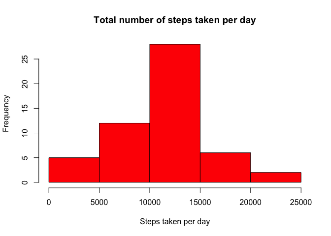
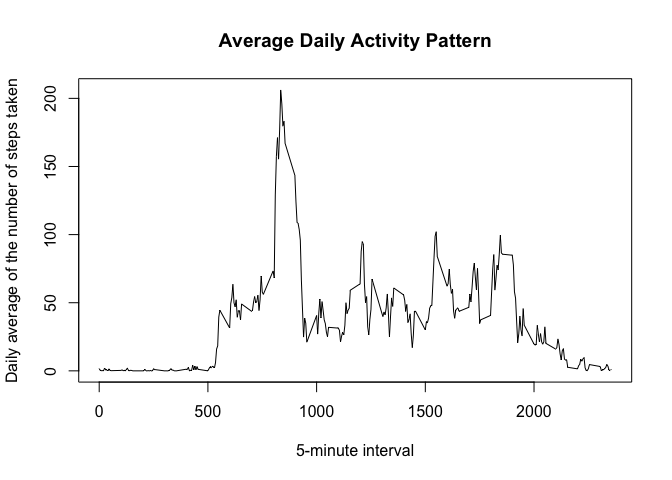
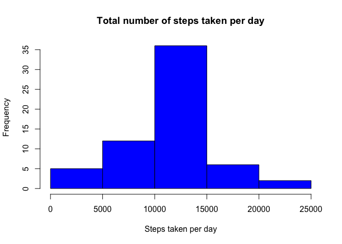
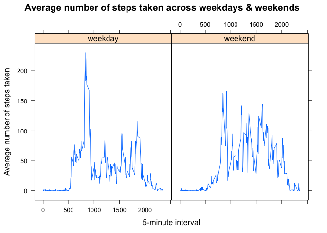

# Reproducible Research: Peer Assessment 1
**********


## Loading and preprocessing the data
Ensure that the activity.csv file is present in the current working directory

```r
library(dplyr)
# Load the data (i.e. read.csv())
activity <- read.csv('activity.csv')
activity$date <- as.Date(activity$date) 
head(activity, 3)
```

```
##   steps       date interval
## 1    NA 2012-10-01        0
## 2    NA 2012-10-01        5
## 3    NA 2012-10-01       10
```

## What is mean total number of steps taken per day?

```r
# Calculate the total number of steps taken per day
total <- activity %>% group_by(date) %>% summarise(steps_per_day = sum(steps))
# Make a histogram of the total number of steps taken each day
hist(total$steps_per_day, main = "Total number of steps taken per day", xlab = "Steps taken per day", col = "red")
```

 

```r
# Calculate and report the mean and median of the total number of steps taken per day
paste("Mean of the total number of steps per day = ", mean(total$steps_per_day, na.rm = TRUE))
```

```
## [1] "Mean of the total number of steps per day =  10766.1886792453"
```

```r
paste("Median of the total number of steps per day = ", median(total$steps_per_day, na.rm = TRUE))
```

```
## [1] "Median of the total number of steps per day =  10765"
```

## What is the average daily activity pattern?

```r
# Make a time series plot (i.e. type = "l") of the 5-minute interval (x-axis) and the average number of steps taken, averaged across all days (y-axis)
daily_average <- activity %>% group_by(interval) %>% summarise(avg_steps_per_day = mean(steps, na.rm = TRUE))
plot(daily_average$interval, daily_average$avg_steps_per_day, type = "l", main = "Average Daily Activity Pattern", xlab = "5-minute interval", ylab = "Daily average of the number of steps taken")
```

 

```r
# Which 5-minute interval, on average across all the days in the dataset, contains the maximum number of steps?
daily_average[which.max(daily_average$avg_steps_per_day), ]
```

```
## Source: local data frame [1 x 2]
## 
##   interval avg_steps_per_day
## 1      835          206.1698
```

## Imputing missing values

```r
# Calculate and report the total number of missing values in the dataset (i.e. the total number of rows with NAs)
paste("Missing values : ", sum(!complete.cases(activity)))
```

```
## [1] "Missing values :  2304"
```

```r
# Devise a strategy for filling in all of the missing values in the dataset.
library(sqldf)
activity_means <- sqldf('SELECT   interval, avg(steps) as meansteps
                         FROM     activity
                         GROUP BY interval
                         ORDER BY interval ')
activity_means <- sqldf('SELECT     a.*, am.meansteps
                         FROM       activity a
                         INNER JOIN activity_means am
                         ON         a.interval = am.interval')
# Create a new dataset that is equal to the original dataset but with the missing data filled in
activity_means$steps[is.na(activity_means$steps)] = activity_means$meansteps
activity_means <- activity_means[,1:3]
# Make a histogram of the total number of steps taken each day
total_new <- activity_means %>% group_by(date) %>% summarise(steps_per_day = sum(steps))
hist(total_new$steps_per_day, main = "Total number of steps taken per day", xlab = "Steps taken per day", col = "blue")
```

 

```r
# Calculate and report the mean and median total number of steps taken per day
paste("Mean of the total number of steps per day = ", mean(total_new$steps_per_day))
```

```
## [1] "Mean of the total number of steps per day =  10766.1886792453"
```

```r
paste("Median of the total number of steps per day = ", median(total_new$steps_per_day))
```

```
## [1] "Median of the total number of steps per day =  10766.1886792453"
```

```r
# Do these values differ from the estimates from the first part of the assignment? What is the impact of imputing missing data on the estimates of the total daily number of steps?
```
There isn't much of a difference with the imputed values. The mean remains the same where as the median changes slightly. The median now tends towards the mean since mean of each interval is the value used for imputing the missing values for each day.

## Are there differences in activity patterns between weekdays and weekends?

```r
activity_means$daytype <- as.factor(ifelse(weekdays(activity_means$date) %in% c("Saturday", "Sunday"),"weekend", "weekday"))
daily_average_new <- activity_means %>% group_by(interval, daytype) %>% summarise(avg_steps_per_day = mean(steps))
library(lattice)
xyplot(avg_steps_per_day ~ interval | daytype, data = daily_average_new, type = "l", main = "Average number of steps taken, across weekdays & weekends ", xlab = "5-minute interval", ylab = "Average number of steps taken")
```

 

From the plot above, it looks like there are more number of steps taken during the weekends when compared to the weekdays
